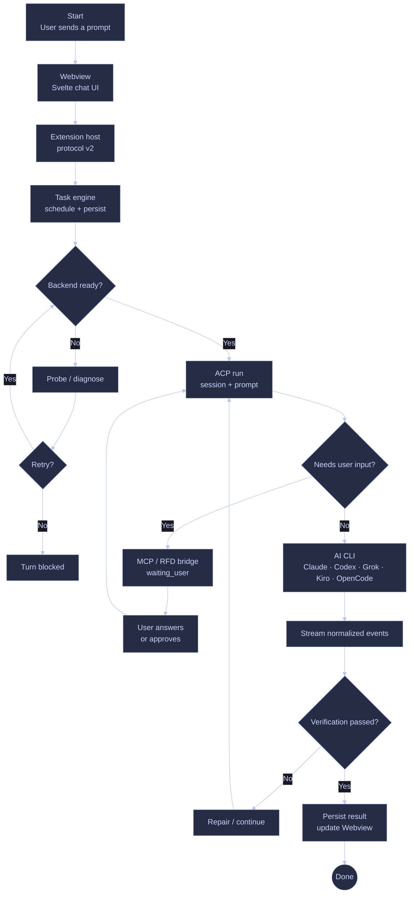
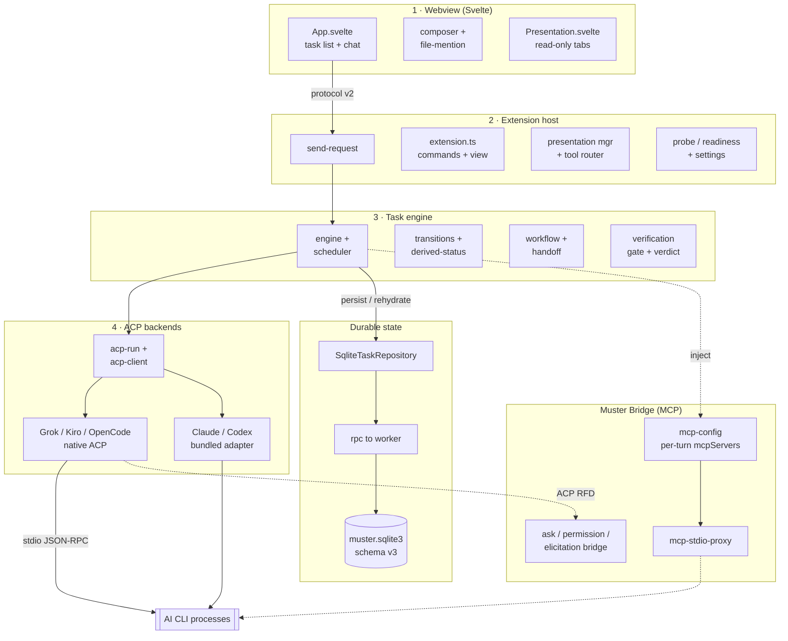
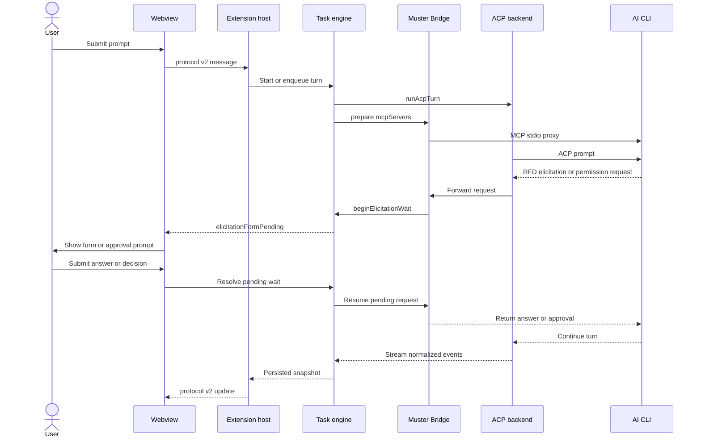
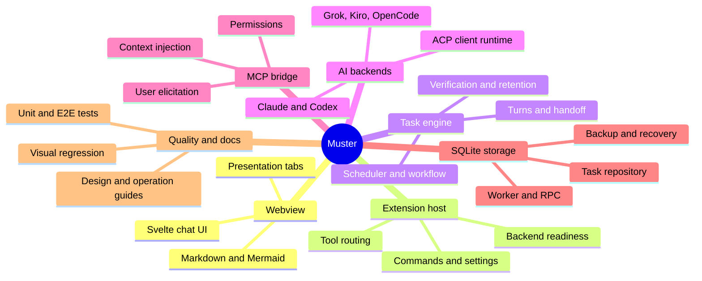

# Architecture diagrams

Two views of the same system. Both are hand-maintained from the source tree, not generated.

| Diagram | Use it for | Shows direction of control? |
|---------|------------|-----------------------------|
| [Project execution flow](#project-execution-flow) | Quick visual overview of a prompt turn, including retry and user-input loops | Yes |
| [Runtime flow](#runtime-flow) | Understanding how a turn actually executes, and who calls whom | Yes |
| [Module inventory](#module-inventory) | Onboarding, locating a subsystem, scoping a change | No |

Prefer the runtime flow when debugging or planning a change that crosses layers. Prefer the
inventory when you need to know *what exists* and where it lives.

Both diagrams render inside Muster itself: the webview pipes fenced `mermaid` blocks through
`webview/src/lib/mermaid-renderer.ts` (`securityLevel: 'strict'` plus a fail-closed
`sanitizeMermaidSvg` DOMPurify pass), so this file doubles as a live rendering check.

## Project execution flow

A compact flowchart in the dark, decision-oriented style used for the quick visual reference.

## Runtime flow

Layers top-level, with the ACP turn path as the spine.

### Reading notes

- **The webview owns no state.** Everything durable round-trips through the host to
  `TaskEngine` and SQLite. There is no JSON task store.
- **`acp-run` has two paths.** Without `RunOptions.mcpSetup` it is the legacy
  session → `onBeforePrompt` → prompt sequence. With `mcpSetup` it runs a hard-capped
  max-2 attempt loop (`prepareAttempt` → `session/load`|`session/new` → `awaitReady` →
  `onBeforePrompt` → prompt once). Exhaustion yields
  `{ mcpSetupCode: 'attempts_exhausted', readinessCode, attemptCount }` with no
  `terminal_received`. `ensureConnected` stays outside the loop.
- **Dotted edges are out-of-band.** MCP injection and RFD elicitation do not follow the
  request/response spine. The callback and user-response loop is shown separately below;
  keeping it out of this DAG preserves the layer ordering.
- **Cancellation is ownership-scoped.** Local live turns settle terminally in-process;
  remotely leased turns persist `cancelRequests` for the owning process to settle.

## Elicitation and approval callback

The callback is intentionally separate from the forward runtime DAG above. It shows the
round-trip when an ACP backend needs user input during a turn.

## Module inventory

This is intentionally a high-level mindmap: the runtime flow and sequence diagram carry the
implementation detail, while this view is for remembering the main system boundaries.

## Keeping these accurate

These diagrams are living documents, same rule as the rest of `docs/`. Update them when a
layer boundary moves, not when a file is renamed inside a layer. Source of truth per box:

| Box | Source of truth |
|-----|-----------------|
| Backends | `src/backends/`, `resources/*-acp/` |
| Task engine | `src/task/` |
| Storage | `src/task/sqlite/`, [SQLITE-STORAGE.md](SQLITE-STORAGE.md) |
| Bridge | `src/bridge/`, [MUSTER-BRIDGE.md](MUSTER-BRIDGE.md), [MCP-INJECTION.md](MCP-INJECTION.md) |
| Host layer | `src/host/`, `src/extension.ts`, `contributes` in `package.json` |
| Webview | `webview/src/`, [WEBVIEW.md](WEBVIEW.md) |
