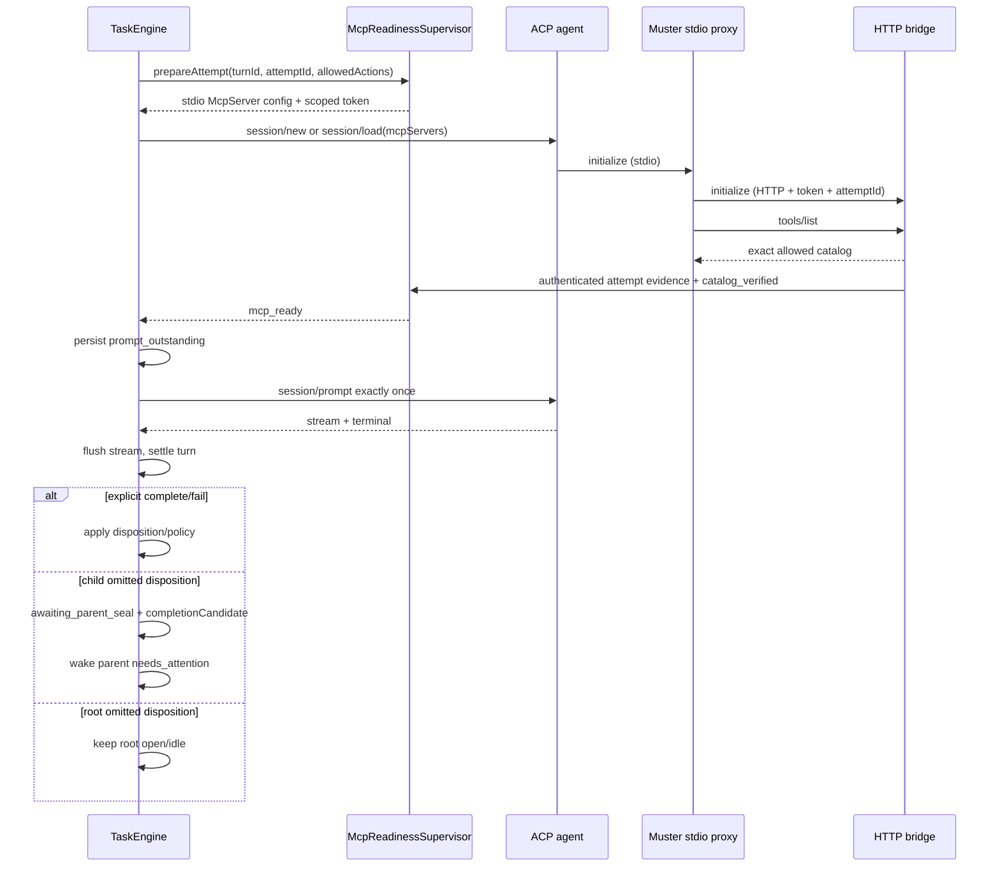

> **OBSOLETE storage notes:** Predates SQLite-only cutover. Do not reintroduce TaskStore / JSON task files. See SQLITE-STORAGE.md.

# Plan: Refactor MCP recovery và lifecycle của sub-agent

## Trạng thái

**PROPOSED — implementation-ready, chưa triển khai**
Ngày lập: 2026-07-16

Plan này thay thế cơ chế `disposition_repair` bằng một lifecycle không phụ thuộc vào việc
model có gọi được MCP tool ở cuối turn hay không, đồng thời làm MCP session có readiness
gate, recovery hữu hạn và transport `stdio` đúng chuẩn ACP. Plan cũng xử lý nguyên nhân
gây gián đoạn từ persistence synchronous, và xóa toàn bộ dead code/tech debt liên quan.

Plan không sửa các file SQLite đang được triển khai song song. Phần storage dưới đây định
nghĩa contract để tích hợp với
[`sqlite-global-storage-refactor.vi.md`](./sqlite-global-storage-refactor.vi.md).

## 1. Kết quả mong muốn

- Một backend turn kết thúc luôn được settle đúng một lần, kể cả khi agent không gọi được
  `complete_task`/`fail_task`.
- Child đã làm xong nhưng thiếu terminal disposition không bị chạy thêm nhiều turn để
  “xin lại” cùng một tool call. Child chuyển sang `awaiting_parent_seal`, lưu summary ứng
  viên và đánh thức parent ngay.
- `complete_task` và `fail_task` vẫn là nguồn outcome tường minh. `end_turn` không tự biến
  thành task success.
- Với ACP backend, `session/prompt` chỉ được gửi sau khi MCP của đúng turn/attempt đã
  initialize và catalog tool khớp credential.
- MCP setup lỗi trước prompt được sửa bằng cách bỏ đúng session hỏng và tạo session mới;
  không restart shared ACP process và không ảnh hưởng agent khác đang chạy.
- ACP dùng một MCP `stdio` proxy do Muster sở hữu. Proxy có retry/reconnect hữu hạn tới
  HTTP bridge nội bộ; direct HTTP chỉ tồn tại tạm như compatibility fallback.
- Streaming không còn gọi full-store synchronous commit trên từng token/chunk.
- Log và snapshot cho biết rõ lỗi ở bridge, proxy, ACP session, tool catalog hay lifecycle;
  không còn kết luận chung chung “tool missing”.
- Xóa `disposition_repair_pending`, repair prompt/turn, reload reconstruction, metrics và
  tests cũ; xóa fallback/adapter tạm khi rollout hoàn tất.

## 2. Kết luận từ trace hiện tại

### 2.1 Đây không phải lỗi đơn thuần của prompt hoặc tool definition

Tool schema và findings của research turn đã tồn tại. Các OpenCode agent khác trong cùng
workflow vẫn gọi được Muster tools và hoàn thành. Repro trực tiếp cũng cho thấy OpenCode
1.18.2 gửi header đúng, bridge chấp nhận kết nối, và nhiều session đồng thời có thể thành
công.

Failure có tính theo-session:

```text
ACP process còn sống
  └─ một session MCP initialize/tools-list lỗi
       ├─ session vẫn chạy model và trả end_turn
       ├─ Muster tools không xuất hiện trong tool list của session đó
       └─ session/load tiếp theo không tự sửa MCP registry đã hỏng
```

Vì vậy sửa prompt chỉ có thể tăng xác suất model thử gọi tool; nó không thể tạo lại một
tool chưa được provider đăng ký trong session.

### 2.2 Direct HTTP hiện tại không có recovery boundary

`src/bridge/mcp-config.ts` inject `muster_bridge` dưới dạng ACP HTTP với bearer token của
turn. `runAcpTurn()` gọi `session/new` hoặc `session/load` rồi đi thẳng tới model selection
và `session/prompt`. Muster không có tín hiệu xác nhận provider đã:

1. initialize MCP;
2. lấy đúng tool catalog;
3. thấy đủ tool được credential cho phép.

Nếu MCP init lỗi nhưng `session/new` vẫn trả session id, engine coi setup là thành công.
Đến cuối turn, việc không có disposition lại bị hiểu như lỗi hành vi của model.

### 2.3 Persistence synchronous làm bridge dễ bị starvation

`TaskStore.commit()` hiện đọc/clone/stringify/fsync toàn bộ JSON store dưới cross-process
lock. `src/task/engine.ts` gọi commit cho từng `assistantDelta`, `reasoningDelta` và nhiều
tool update. Bridge HTTP và engine cùng chạy trên VS Code extension-host event loop, nên
delta storm có thể trì hoãn MCP initialize/list/call đúng vào setup window của provider.

Baseline đang lưu trong
[`sqlite-global-storage-baseline.vi.md`](./sqlite-global-storage-baseline.vi.md) cho thấy
chi phí full-store commit tăng mạnh theo kích thước dữ liệu. Đây là trigger làm lỗi theo
timing dễ xảy ra hơn, không phải lời giải thích thay thế cho sticky MCP session.

### 2.4 `disposition_repair` biến một lỗi transport thành vòng lặp model

Hiện tại successful backend turn nhưng không có disposition sẽ:

```text
disposition_repair_pending
  → enqueue <turn>-disposition-repair
  → yêu cầu model gọi lại complete_task/fail_task
  → MCP session vẫn thiếu tool hoặc lại lỗi
  → missing_disposition / retry / reload reconstruction
```

Lifecycle của process và outcome của task đang bị ghép sai:

- ACP `end_turn` chứng minh backend turn đã kết thúc.
- `complete_task`/`fail_task` là đề xuất outcome có chủ đích.
- Thiếu outcome không có nghĩa backend turn chưa kết thúc.

Một model turn mới không phải cơ chế recovery phù hợp cho một MCP session đã hỏng.

## 3. Bài học từ Intent by Augment

Intent hiện dùng một MCP `stdio` proxy riêng cho agent, nối tiếp tới HTTP bridge. Các điểm
đáng áp dụng:

- proxy startup có bounded backoff và vẫn sống để request sau có thể reconnect;
- lỗi `ECONNREFUSED`, reset, network/socket kích hoạt một reconnect được coalesce;
- backend completion là lifecycle ground truth, không phụ thuộc hoàn toàn vào tool report;
- parent listener/wait được đăng ký trước khi child bắt đầu;
- terminal handling idempotent và flush stream trước khi phát completion;
- thiếu workspace tool lặp lại sẽ buộc fresh session thay vì tiếp tục load session hỏng;
- persistence stream theo batch/per-agent queue, không ghi mỗi chunk;
- chỉ một orchestrator/tool namespace được phép sở hữu sub-agent lifecycle.

Các điểm không copy nguyên xi:

- Không mặc định `end_turn` = `complete_task`. Muster có parent-seal policy và phải giữ
  outcome authority an toàn.
- Không replay prompt sau khi đã dispatch vì tool/file side effect có thể đã xảy ra.
- Không kill shared ACP process để sửa một session; Muster hiện multiplex nhiều session
  trên process đó.
- Không retry mù một mutating `tools/call`; chỉ retry khi operation có idempotency key và
  ledger bảo vệ duplicate.

## 4. Invariant thiết kế

Các invariant sau phải có test trước khi rollout:

1. **Prompt gate:** `session/prompt` không được gọi trước `mcp_ready` của cùng
   `turnId + attemptId`.
2. **At-most-once dispatch:** một `TaskTurn` chỉ có tối đa một lần chuyển durable từ
   `pre_dispatch` sang `prompt_outstanding`.
3. **Pre-dispatch-only recovery:** automatic session retry chỉ được thực hiện khi prompt
   chưa dispatch.
4. **Session isolation:** MCP failure của session A không teardown shared ACP process và
   không cancel session B.
5. **Terminal idempotency:** một run generation chỉ settle turn và wake parent một lần.
6. **Outcome separation:** backend terminal không tự seal task success/failure.
7. **No repair turn:** thiếu disposition không bao giờ tự tạo model turn mới.
8. **Wake-before-run:** compound wait được persist trong cùng transaction tạo/release
   child, trước khi child được schedule. Cơ chế hiện tại đã có invariant này và phải giữ.
9. **Flush-before-terminal:** transcript/tool batch được flush trước settle/wake/snapshot.
10. **Secret hygiene:** token không xuất hiện trong argv, persisted diagnostics, raw output
    hoặc log.
11. **Bounded recovery:** mọi retry có số lần, deadline và terminal state rõ ràng; không có
    loop vô hạn.
12. **Exact catalog:** tool catalog observed phải khớp tập action được credential cho phép;
    session không được ready chỉ vì bridge port đang mở.

## 5. Kiến trúc đích



Recovery trước prompt:

```text
attempt 1: load/new session
  └─ readiness timeout / wrong catalog / proxy unavailable
       ├─ revoke attempt credential
       ├─ best-effort session/close (không kill ACP process)
       ├─ invalidate resume cho riêng turn này
       └─ attempt 2: fresh session/new + bounded recovery context
            ├─ ready  -> dispatch prompt một lần
            └─ fail   -> settle safe_to_retry/mcp_unavailable, parent wake nếu cần
```

## 6. Refactor lifecycle

### 6.1 Tách stream completion khỏi task outcome

Tạo một terminal path duy nhất, ví dụ `finalizeTurnRun(runId, terminal)`:

1. kiểm tra run generation chưa được finalize;
2. ngừng nhận delta mới cho generation đó;
3. flush persistence buffer;
4. complete các assistant/tool message còn mở;
5. apply `TaskTurn.disposition` nếu có;
6. settle turn;
7. reconcile wait/dependency và schedule continuation đúng một lần.

Các path success, failure, cancellation, timeout và backend exit phải dùng cùng terminal
guard. `settling` hiện tại có thể được giữ làm in-memory guard, nhưng durable turn status +
run generation mới là source of truth qua reload/multi-window.

### 6.2 State mới khi child thiếu disposition

Thay `disposition_repair_pending` và `missing_disposition` bằng một attention state rõ nghĩa:

```ts
type TaskAttentionCode =
  | /* existing */
  | 'awaiting_parent_seal'
  | 'mcp_unavailable';

interface TaskCompletionCandidateV1 {
  version: 1;
  sourceTurnId: string;
  observedAt: string;
  summary: string;
  reason: 'missing_disposition' | 'mcp_unavailable';
  mcpFailure?: {
    code: McpFailureCode;
    attemptCount: number;
  };
}
```

Quy tắc:

- Non-root child có successful terminal, không `wait_tasks`, không pending question và
  không complete/fail: lưu `completionCandidate`, set `awaiting_parent_seal`, giữ task
  `open`, wake parent bằng existing `needs_attention` path.
- Summary lấy từ final assistant message đã complete; fallback là một thông báo ngắn có
  cấu trúc. Không đưa reasoning/raw log vào candidate.
- Candidate không ghi vào `taskResult` và không tự đổi lifecycle.
- Parent có thể gọi existing `set_task_lifecycle` để seal, `continue_child` để yêu cầu bổ
  sung, hoặc cancel/fail theo policy.
- Root task không có parent để seal và normal chat không bắt buộc terminal tool: successful
  turn thiếu disposition chỉ giữ root `open`/idle, không tạo attention giả.
- Nếu mọi MCP setup attempt đều hỏng trước prompt, turn fail ở `pre_dispatch`, task nhận
  `mcp_unavailable`, và parent/user được đánh thức để retry sau. Setup controller đã dùng
  hết retry budget nên generic task retry không được tự tạo thêm model turn cho cùng lỗi.
- `awaiting_parent_answer`, explicit `wait_tasks`, cancel và dependency terminal giữ semantics
  hiện có.

### 6.3 Migration dữ liệu

Tăng JSON store schema từ v6 lên v7 nếu lifecycle refactor land trước SQLite migration:

- `disposition_repair_pending` -> `awaiting_parent_seal`;
- `missing_disposition` -> `awaiting_parent_seal`;
- dựng `completionCandidate` từ final completed assistant message của `sourceTurnId` khi có;
- queued repair turn chưa chạy: chuyển `cancelled` với machine reason
  `obsolete_disposition_repair`;
- running repair turn khi reload: interrupt theo existing safe reload path, không replay;
- giữ historical messages/turns để audit, nhưng không schedule chúng;
- không xóa transcript cũ âm thầm.

SQLite importer/codec phải áp dụng cùng normalization để JSON legacy không tái tạo state
cũ sau cutover.

## 7. MCP readiness và recovery

### 7.1 `McpReadinessSupervisor`

Thêm một component runtime trong extension host với trách nhiệm giới hạn:

```ts
interface McpAttemptHandle {
  turnId: string;
  attemptId: string;
  servers: McpServerConfig[];
  expectedToolNames: readonly string[];
  awaitReady(signal: AbortSignal, deadlineAt: number): Promise<McpReadyEvidence>;
  dispose(reason: string): void;
}

interface McpReadinessSupervisor {
  prepareAttempt(input: {
    turnId: string;
    allowedActions: ReadonlySet<ToolAction>;
    transport: 'stdio_proxy' | 'http_direct';
  }): McpAttemptHandle;
}
```

`prepareAttempt` tạo `attemptId` và credential mới. Credential context mang cả
`turnId + attemptId`; dispose/retry revoke token cũ. Evidence từ attempt cũ không thể làm
attempt mới pass nhầm.

Readiness không chỉ là `/health`. Nó cần đủ:

- provider đã initialize proxy/bridge của attempt;
- remote bridge connect thành công;
- `tools/list` trả catalog;
- catalog name set bằng đúng `allowedActions` đã filter;
- reserved server name là `muster_bridge`;
- evidence đến trước setup deadline.

Proxy chỉ mở remote MCP connection sau khi nhận local provider initialize. Mọi request
proxy -> bridge mang attempt id; bridge đối chiếu id đó với credential context rồi phát
evidence in-process cho supervisor. Không tạo unauthenticated status channel riêng.

Chỉ persist milestone cuối (`ready`, `unavailable`) và last structured failure. Các trạng
thái transient/backoff nằm trong memory/telemetry để không tạo thêm write storm.

### 7.2 Failure taxonomy

Không parse raw assistant output để suy ra MCP health. Dùng code có cấu trúc:

```ts
type McpFailureCode =
  | 'bridge_unreachable'
  | 'bridge_auth_rejected'
  | 'proxy_spawn_failed'
  | 'provider_initialize_timeout'
  | 'remote_initialize_failed'
  | 'tools_list_failed'
  | 'tool_catalog_mismatch'
  | 'session_setup_failed'
  | 'session_registry_sticky'
  | 'setup_deadline_exceeded';
```

Mỗi failure có `phase`, `attempt`, `retriable`, sanitized message và timestamp. Token,
header, prompt, cwd tuyệt đối và raw conversation không được persist.

### 7.3 Bridge health và observer hooks

`src/bridge/server.ts` cần:

- `GET /health` rất rẻ, không đọc `TaskStore`, trả `status`, `generation`, `startedAt`;
- observer hook cho authenticated initialize, list và call events theo credential attempt;
- explicit auth failure trong `ListTools` thay vì trả catalog rỗng;
- structured catch logging với request id/phase, không log token/body;
- close/TTL cleanup cho transport không còn active;
- coalesce concurrent health/reconnect checks trong supervisor;
- generation đổi khi bridge restart để stale readiness evidence bị vô hiệu.

`/health` chỉ dùng phân biệt process/port unavailable. Nó không được thay exact catalog
verification.

## 8. MCP stdio proxy

### 8.1 Vì sao chọn `stdio`

ACP schema hiện hành định nghĩa `McpServerStdio` với `command`, `args`, `env`, và yêu cầu
mọi ACP agent hỗ trợ transport này. HTTP/SSE phụ thuộc advertised capability. Vì vậy
Muster dùng `stdio` làm path chuẩn, không phải workaround riêng cho OpenCode.

Mở rộng `McpServerConfig` trong `src/types.ts` theo đúng wire shape:

```ts
type McpServerConfig =
  | {
      name: string;
      command: string;
      args: string[];
      env: { name: string; value: string }[];
    }
  | { type: 'http'; name: string; url: string; headers: HttpHeader[] }
  | { type: 'sse'; name: string; url: string; headers: HttpHeader[] };
```

Không thêm `type: 'stdio'` nếu ACP schema/provider không nhận field đó.

### 8.2 Process và secret contract

Thêm entrypoint đóng gói, ví dụ `src/bridge/mcp-stdio-proxy.ts`, được build thành CJS có thể
spawn độc lập.

ACP config dùng executable của extension runtime với Node mode và truyền secret qua env:

```text
command = process.execPath
args    = [<absolute packaged proxy script>]
env     = ELECTRON_RUN_AS_NODE=1
          MUSTER_BRIDGE_URL=http://127.0.0.1:<port>/mcp
          MUSTER_BRIDGE_TOKEN=<scoped attempt token>
          MUSTER_MCP_ATTEMPT_ID=<attempt id>
```

Phải có packaging smoke test trên minimum VS Code, current stable và Remote Extension Host.
Nếu `process.execPath + ELECTRON_RUN_AS_NODE` không hoạt động ở một supported host, build
một platform-neutral launcher được đóng gói cùng extension; không fallback sang Node trên
`PATH` một cách im lặng.

### 8.3 Proxy state machine

```text
starting
  -> connecting_remote
  -> ready
  -> degraded (reconnectable)
  -> connecting_remote
  -> ready | unavailable
  -> closed
```

Yêu cầu:

- startup backoff hữu hạn, tối đa khoảng 15 giây và luôn bị chặn bởi turn setup deadline;
- một reconnect promise được share cho concurrent request;
- reconnect trên `ECONNREFUSED`, `ECONNRESET`, aborted fetch/network/socket;
- `initialize`/`tools/list` được retry sau reconnect;
- `tools/call` chỉ retry nếu action là read-only hoặc args có `opId` và handler đó được
  operation ledger bảo vệ; nếu không thì trả structured uncertain error;
- retry original request tối đa một lần sau reconnect;
- proxy không exit chỉ vì bridge tạm unavailable; request sau có thể kích hoạt reconnect;
- provider initialize + verified remote catalog được báo cho readiness supervisor;
- stdout chỉ chứa MCP protocol; diagnostics đi stderr đã sanitize;
- không log env/token/header/raw tool body.

Proxy chỉ forward Muster tool surface cần thiết. Không trở thành một orchestrator thứ hai,
không thêm native sub-agent tool và không merge tool namespace không thuộc Muster.

### 8.4 Reserved-name/conflict policy

- `muster_bridge` là reserved server name.
- Built-in context engine dùng tên khác (`context_engine`).
- Nếu sau này user MCP config cho phép custom server, config trùng reserved name phải fail
  validation rõ ràng; không dùng “last one wins”.
- Không expose cả native provider sub-agent orchestration và Muster delegation trong cùng
  policy nếu hai bên có thể tạo child độc lập mà host không theo dõi.

## 9. ACP session recovery

### 9.1 Refactor `RunOptions`

Thay static-only `mcpServers` bằng controller nhưng giữ compatibility cho non-ACP backend:

```ts
interface RunOptions {
  // existing fields...
  mcpSetup?: {
    maxAttempts: number; // default 2
    prepareAttempt(attempt: number): McpAttemptHandle;
    buildFreshSessionPrompt?(originalPrompt: string): Promise<string>;
  };
}
```

`mcpServers`/`mcpConfigPath` cũ chỉ giữ ở adapter boundary trong giai đoạn migration, không
để engine có hai source of truth lâu dài.

### 9.2 Setup loop trong `runAcpTurn`

Refactor session setup thành helper độc lập, có characterization test cho cả năm ACP
adapter:

1. `ensureConnected()` shared ACP process;
2. prepare attempt + MCP config;
3. `session/load` khi resume còn hợp lệ, nếu không `session/new`;
4. register session sink;
5. apply model;
6. `awaitReady()`;
7. nếu failure retriable và prompt còn `pre_dispatch`: close session, dispose attempt, tạo
   fresh attempt;
8. chỉ sau ready mới gọi `onBeforePrompt()` rồi `session/prompt()`.

Không gọi `teardownProcess()` trong recovery path. `session/close` là best effort; nếu agent
không support close, bỏ reference session và để provider tự cleanup.

Sau attempt cuối, backend trả structured setup failure cho engine. Turn giữ
`failureClass='safe_to_retry'` vì prompt chưa dispatch, nhưng failure mang
`retryOwner='mcp_setup'`/`attemptsExhausted=true` để `applyFailedTurn` không enqueue generic
automatic retry. User hoặc parent có thể tạo continuation mới khi bridge/provider đã khỏe.

### 9.3 Recovery khi `session/load` bị sticky

Retry cùng session id không đủ cho repro hiện tại. Attempt cuối dùng `session/new`, nhưng
không được mất conversation context.

Thêm một bounded `buildFreshSessionRecoveryPrompt()` dùng dữ liệu durable:

- common trusted host/task bootstrap;
- task brief/goal và resolved input pins;
- compact transcript từ các completed turns trước;
- final assistant/tool outcomes cần thiết;
- current user/child-result input;
- marker máy đọc được rằng đây là fresh-session recovery, không phải user yêu cầu mới.

Persist prompt variant hoặc digest + recovery mode trên `TaskTurn` trước dispatch để reload
không tự compile thành nội dung khác. Dùng cùng budget/sanitizer với existing handoff
continuation. Nếu không tạo được recovery prompt trong budget, fail `pre_dispatch` với
`mcp_unavailable`/`prompt_budget_exceeded`; không dispatch fresh session thiếu context.

### 9.4 Không replay sau dispatch

Sau `onBeforePrompt()`:

- MCP/tool lỗi được surface như tool error cho model hoặc terminal failure;
- không automatic fresh session;
- không replay prompt;
- settle theo `terminal_received`, `uncertain`, cancel hoặc run timeout hiện có;
- parent/user quyết định retry ở task level.

## 10. Streaming persistence và event-loop liveness

### 10.1 Contract chung

Thêm `TurnStreamPersistence`/repository command có ordering theo `turnId + streamSequence`:

```ts
interface TurnStreamPersistence {
  append(events: readonly PersistableTurnEvent[]): void;
  flush(reason: 'timer' | 'count' | 'tool_boundary' | 'terminal' | 'shutdown'): Promise<void>;
  close(): Promise<void>;
}
```

Flush khi điều kiện đầu tiên xảy ra:

- 50–100 ms;
- 50 chunks/events;
- tool start/complete hoặc disposition boundary;
- terminal/error/cancel;
- extension deactivate/process shutdown.

Yêu cầu:

- exact transcript content/order không đổi;
- bounded memory và backpressure;
- một write queue FIFO cho mỗi turn, DB worker serialize transaction;
- terminal không publish trước terminal flush;
- UI nhận incremental patch độc lập với durable batch cadence;
- không persist mỗi health/backoff tick.

### 10.2 Tích hợp SQLite đang triển khai

Path chính sau repository boundary là named command `appendTranscriptBatch` trong DB worker,
đúng với plan SQLite hiện có. Không đưa arbitrary callback `commit(draft)` qua worker.

Nếu lifecycle/MCP fix cần release trước khi SQLite repository hoàn tất, cho phép một adapter
tạm `JsonTurnStreamBuffer` gom delta thành ít `TaskStore.commit()` hơn. Adapter này phải:

- nằm sau cùng interface;
- có test exact-output và terminal flush;
- được đánh dấu deletion gate;
- bị xóa ngay khi `appendTranscriptBatch` production path land.

Không mở rộng JSON adapter thành storage architecture thứ hai.

## 11. Observability

### 11.1 Structured events

Thêm event/log tối thiểu:

```text
mcp.attempt.start
mcp.proxy.spawned
mcp.remote.connected
mcp.catalog.verified
mcp.attempt.ready
mcp.attempt.failed
mcp.session.recovered_fresh
mcp.prompt.dispatched
mcp.transport.degraded
turn.finalized
task.awaiting_parent_seal
parent.wait.woken
```

Mỗi event chỉ cần `taskId`, `turnId`, `attemptId`, backend, phase, duration, failureCode,
bridgeGeneration và count/hash catalog. Không log token, headers, prompts hoặc tool output.

### 11.2 Metrics/diagnostics

Theo dõi:

- MCP ready first-attempt rate;
- fresh-session recovery rate/success rate;
- readiness p50/p95/p99;
- catalog mismatch/auth rejection;
- prompt-before-ready violation (phải luôn bằng 0);
- child awaiting-parent-seal count và age;
- repair turns created (phải luôn bằng 0 sau migration);
- stream batch size, flush latency, write queue depth;
- bridge event-loop lag và request latency;
- parent-wake latency sau child terminal/attention.

UI child summary thay `repairPending` bằng `awaitingParentSeal`. Message phải nói rõ “child
đã kết thúc turn, đang chờ parent xác nhận outcome”, không gọi là retry.

## 12. Kế hoạch triển khai theo PR/commit

### PR 0 — Characterization và fault harness

Mục tiêu: khóa behavior hiện tại và tạo repro deterministic trước khi refactor.

- Thêm fake MCP bridge/proxy có thể fail lần đầu ở initialize, list, call và connection.
- Thêm fake ACP agent giữ MCP registry failed theo session nhưng process vẫn sống.
- Ghi test chứng minh session B vẫn chạy khi session A MCP fail.
- Ghi benchmark delta storm và event-loop lag bên cạnh SQLite baseline.
- Không đổi production behavior trong PR này.

Gate:

- repro đỏ đúng ở “prompt dispatched dù MCP chưa ready”;
- repro đỏ đúng ở “repair turn được tạo”;
- baseline ghi commit count và latency, không chỉ wall-clock tổng.

### PR 1 — Lifecycle decoupling và xóa repair loop

Files chính:

- `src/task/types.ts`
- `src/task/transitions.ts`
- `src/task/engine.ts`
- `src/task/store.ts`
- `src/host/snapshot.ts`
- `webview/src/lib/protocol.ts`
- tests tương ứng

Công việc:

- thêm `completionCandidate` và `awaiting_parent_seal`;
- successful child terminal thiếu disposition -> candidate + parent wake;
- root successful terminal thiếu disposition -> open/idle;
- migration v7;
- xóa toàn bộ enqueue/reload/escalation của disposition repair;
- đổi snapshot/UI count;
- cập nhật host instruction để parent dùng `set_task_lifecycle` hoặc `continue_child`.

Gate:

- không có model repair turn;
- parent compound wait được wake đúng một continuation;
- explicit complete/fail/wait/pending-question không đổi;
- legacy repair state migrate idempotent.

### PR 2 — Stream batching / repository seam

Files chính:

- `src/task/engine.ts`
- repository/SQLite worker files theo plan SQLite đang triển khai
- temporary JSON adapter chỉ khi thật sự cần

Công việc:

- gom assistant/reasoning/tool deltas;
- terminal flush + bounded queue;
- UI patch không đợi DB full snapshot;
- đo bridge latency dưới 8–12 concurrent turns.

Gate:

- 10.000 chunks giữ exact transcript nhưng số durable writes được bound theo batch, không
  tỷ lệ 1:1 với chunk;
- crash/reload sau flushed batch không corrupt;
- terminal không xuất hiện trước dữ liệu cuối.

### PR 3 — Readiness supervisor và bridge instrumentation

Files chính:

- `src/bridge/server.ts`
- `src/bridge/credentials.ts`
- component readiness mới
- `src/task/engine.ts`
- bridge tests

Công việc:

- per-attempt credential/context;
- `/health`, bridge generation, authenticated observer hooks;
- exact catalog verification;
- failure taxonomy và sanitized logs;
- bounded setup semaphore để tránh initialize storm, không giảm global task concurrency.

Gate:

- wrong token/wrong catalog không ready;
- stale attempt evidence không unlock attempt mới;
- health endpoint không chạm storage;
- concurrent probes coalesced.

### PR 4 — ACP stdio proxy và provider contract matrix

Files chính:

- `src/types.ts`
- `src/bridge/mcp-config.ts`
- `src/bridge/mcp-stdio-proxy.ts` (mới)
- build/package config
- adapter contract tests

Công việc:

- thêm ACP stdio wire type;
- proxy state machine, reconnect và retry policy;
- token/attempt qua env;
- reserved name validation;
- contract test Claude, Codex, Grok, Kiro, OpenCode;
- direct HTTP giữ bằng internal rollout fallback, không expose thành user setting.

Gate:

- provider thực sự spawn packaged proxy;
- bridge restart tạm thời được proxy recover;
- stdout sạch MCP protocol;
- VSIX/Remote smoke test tìm được entrypoint;
- source/log scan không lộ bearer.

### PR 5 — Pre-dispatch session recovery

Files chính:

- `src/backends/acp-run.ts`
- `src/backends/acp-client.ts`
- `src/types.ts`
- `src/task/engine.ts`
- fresh-session recovery prompt helper/tests

Công việc:

- session setup loop tối đa hai attempt;
- await readiness trước `onBeforePrompt`;
- best-effort close đúng failed session;
- sticky `session/load` -> fresh `session/new` với durable recovery prompt;
- không teardown shared ACP process;
- failure structured về engine.

Gate:

- fail first initialize/list rồi recover: prompt gọi đúng một lần;
- fail cả hai attempt: prompt gọi zero lần và turn settle `safe_to_retry`/attention rõ;
- session B stream không gián đoạn;
- abort/setup timeout dọn credential/proxy/session;
- không replay sau `prompt_outstanding`.

### PR 6 — Rollout, remove fallback và final debt sweep

- chạy compatibility window với metric `stdio_proxy` vs `http_direct`;
- khi tất cả supported ACP backend pass, xóa direct-HTTP path riêng của built-in
  `muster_bridge`;
- xóa temporary JSON streaming adapter sau SQLite cutover;
- xóa legacy schema normalizer chỉ khi minimum supported migrated version cho phép;
- cập nhật docs/architecture và mark plan cũ về disposition repair là superseded;
- chạy `rg` debt ledger và source-boundary scan.

## 13. Dead-code và tech-debt ledger

### 13.1 Xóa trong PR 1

- `TaskAttentionCode.disposition_repair_pending`.
- `-disposition-repair` turn-id convention.
- `TaskEngine.enqueueDispositionRepair()` toàn bộ.
- settle-success branch gọi enqueue repair.
- reload branch reconstruct/requeue repair.
- settle-failure branch escalate repair -> `missing_disposition`.
- transition special-case phân biệt normal/repair turn.
- `resolveChildWait` exemption làm repair pending không wake parent.
- host snapshot field/count/label `repairPending`.
- webview protocol `repairPending`.
- tests có tên/expectation disposition repair trong:
  - `src/task/transitions.test.ts`;
  - `src/task/engine-graph.test.ts`;
  - `src/host/snapshot.test.ts`.
- repair prompt text và comments `P0.5` không còn đúng.

Không xóa:

- `complete_task`, `fail_task`;
- operation ledger/idempotency;
- parent `set_task_lifecycle`;
- explicit `wait_tasks`/question flow;
- terminal disposition conflict protection.

### 13.2 Xóa hoặc sửa trong PR 3–5

- comment sai “http/sse only over ACP” trong `src/types.ts`.
- raw/generic bridge catch không log phase.
- invalid-auth ListTools trả catalog rỗng.
- static MCP config là source of truth duy nhất, vì không biểu diễn attempt/recovery.
- string matching raw output để suy luận tool availability nếu còn nơi nào sử dụng.
- duplicated adapter setup drift sau khi setup loop đã có shared characterization tests.
- stale transport entries không có close/TTL cleanup.

### 13.3 Xóa sau rollout

- direct HTTP config riêng cho built-in `muster_bridge` sau compatibility window.
- internal feature flag/fallback metric của rollout.
- temporary `JsonTurnStreamBuffer`.
- per-delta `TaskStore.commit()` branches.
- JSON lock/clone/full-write production path sau SQLite migration; chỉ giữ importer/backup
  theo retention policy của plan SQLite.
- tài liệu cũ hướng dẫn disposition repair; giữ file lịch sử nếu cần nhưng thêm header
  `SUPERSEDED`, không để nó tiếp tục là implementation guidance.

### 13.4 Không mở rộng scope sang debt không liên quan

Plan này không làm lại các phần đã implement trong plan orchestration liveness, không khôi
phục `start_task`/live inject cũ, không thay permissions mode và không redesign toàn bộ
shared ACP client. Per-process ACP isolation chỉ xem xét sau nếu metric chứng minh session
close không đủ; không phải điều kiện của fix này.

## 14. Test matrix bắt buộc

| Case | Kỳ vọng |
|---|---|
| First MCP initialize trả 503 | attempt 1 fail, fresh session ready, prompt đúng 1 lần |
| First `tools/list` reset socket | proxy reconnect + list retry, catalog verified |
| Tool catalog thiếu `complete_task` | session không ready, prompt 0 lần |
| Token của attempt cũ báo ready muộn | bị ignore |
| `session/load` giữ registry hỏng | fallback `session/new` với recovery prompt |
| Session A MCP fail, session B đang stream | B không bị cancel/restart |
| Bridge restart trước prompt | bounded reconnect/recovery |
| Bridge mất sau prompt | không replay; structured tool/turn failure |
| Mutating call mất response có `opId` | retry tối đa 1, ledger chỉ apply 1 lần |
| Mutating call không có idempotency evidence | không retry mù |
| Child end_turn không disposition | no repair; candidate + parent wake |
| Root end_turn không disposition | root open/idle, không fake success |
| Explicit `complete_task` | semantics/policy hiện có giữ nguyên |
| Child hoàn thành ngay sau delegate+wait | không mất wake |
| Reload có legacy repair pending/queued | migrate/cancel idempotent, không schedule |
| 10k stream chunks | exact order/content, bounded writes |
| Terminal trong lúc batch pending | flush xong mới settle/wake |
| Unauthorized list/call | explicit auth error, không leak catalog/token |
| Extension deactivate | flush, revoke credential, close proxy/transport |

Mỗi ACP backend cần contract suite dùng cùng fixture. OpenCode có thêm live smoke vì đây là
backend đã tái hiện sticky MCP session; không được biến fix thành branch chỉ dành cho
`backend.name === 'opencode'`.

## 15. Acceptance criteria

- [ ] Không còn symbol/runtime state `disposition_repair_pending` trong production source.
- [ ] Không còn turn được tạo với suffix `-disposition-repair`.
- [ ] Backend terminal luôn settle turn dù terminal MCP tool không được gọi.
- [ ] Child thiếu outcome wake parent trong một reconciliation cycle và giữ lifecycle open.
- [ ] `end_turn` không tự seal succeeded.
- [ ] ACP prompt không chạy nếu MCP readiness chưa pass.
- [ ] First-attempt MCP failure có thể recover bằng fresh session mà không ảnh hưởng session khác.
- [ ] Prompt at-most-once được chứng minh bằng fault-injection tests.
- [ ] Stdio proxy là default cho mọi supported ACP backend.
- [ ] Direct HTTP fallback có metric và deletion date/gate, không tồn tại vô thời hạn.
- [ ] Stream writes được batch; extension-host event-loop không bị full-store commit mỗi chunk.
- [ ] Không có secret trong argv/log/persisted diagnostics.
- [ ] Legacy store migration không mất transcript và không tái schedule repair turn.
- [ ] SQLite importer hiểu state/schema mới.
- [ ] Snapshot/webview hiển thị `awaitingParentSeal`, không hiển thị repair retry.

## 16. Verification gates

Targeted trong từng PR:

```bash
npx vitest run src/task/transitions.test.ts src/task/engine-graph.test.ts
npx vitest run src/bridge/mcp-config.test.ts src/bridge/server.test.ts
npx vitest run src/backends/acp-client.test.ts src/backends/claude.test.ts src/backends/codex.test.ts src/backends/grok.test.ts src/backends/kiro.test.ts src/backends/opencode.test.ts
```

Full gate trước merge:

```bash
npm test
npm run compile
npm run check:svelte
npm run test:source-boundary
```

Live/packaging gate:

- minimum VS Code 1.101;
- stable VS Code hiện hành;
- Remote SSH/Dev Container extension host;
- OpenCode live fault injection với 8–12 concurrent child sessions;
- VSIX contents check có proxy entrypoint và không có source map chứa secret fixture;
- event-loop lag/bridge latency so với baseline trước refactor.

## 17. Rollout và rollback

Rollout theo internal percentage/provider allowlist:

1. stdio proxy shadow diagnostics, direct HTTP vẫn active;
2. stdio default cho OpenCode/Codex test cohort;
3. mở cho toàn bộ ACP backend khi contract/live gate pass;
4. xóa direct HTTP fallback ở release kế tiếp nếu failure rate không regression.

Rollback chỉ đổi transport cho **new turns**. Running turn giữ frozen attempt config; không
hot-swap MCP trong một prompt đang chạy. Lifecycle refactor và removal repair loop không
rollback, vì đây là sửa correctness độc lập với transport.

## 18. Tài liệu tham chiếu

- ACP protocol/schema chính thức:
  <https://github.com/agentclientprotocol/agent-client-protocol>
- ACP session setup/MCP server contract:
  <https://agentclientprotocol.com/protocol/session-setup#mcp-servers>
- SQLite refactor đang triển khai:
  [`sqlite-global-storage-refactor.vi.md`](./sqlite-global-storage-refactor.vi.md)
- Orchestration liveness đã implement:
  [`orchestration-liveness-runtime-storage-settings.vi.md`](./orchestration-liveness-runtime-storage-settings.vi.md)
- Parent seal semantics:
  [`coordinator-host-context-and-seal.md`](./coordinator-host-context-and-seal.md)
- Intent installed artifact đã audit:
  `/Applications/Intent by Augment.app/Contents/Resources/app.asar` và
  `app.asar.unpacked/dist/main/mcp-stdio-server.cjs`.

## 19. Definition of done

Hạng mục chỉ được coi là hoàn tất khi tất cả acceptance criteria và verification gates qua,
fault injection chứng minh prompt at-most-once, live OpenCode không còn session thiếu Muster
tools mà vẫn được dispatch, và debt ledger không còn item production nào ngoài fallback có
deletion gate ghi rõ. Việc “agent cuối cùng vẫn trả được summary” không được dùng thay cho
MCP readiness test; ngược lại, một MCP outage cũng không được phép làm child mắc kẹt nhiều
turn nếu summary đã tồn tại.
